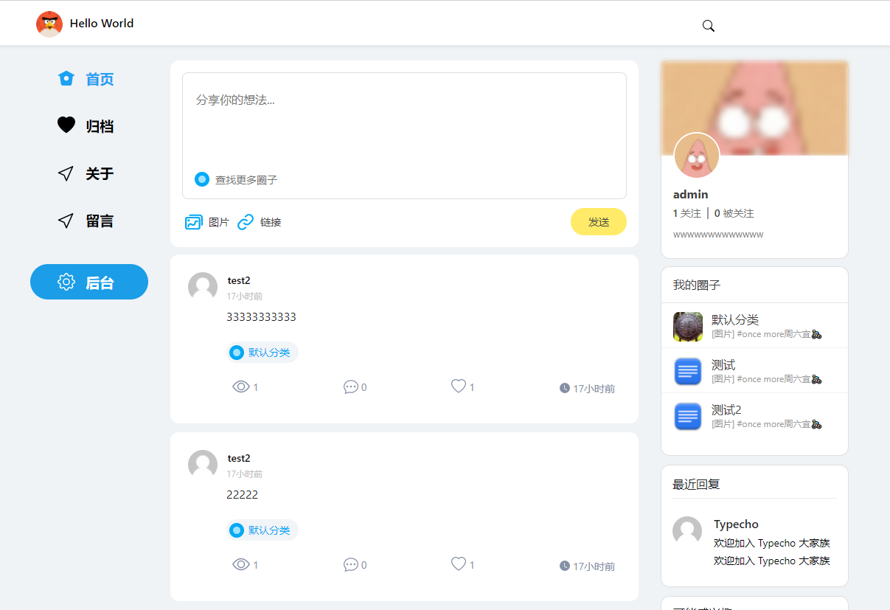
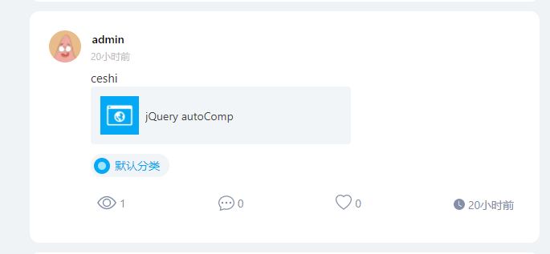
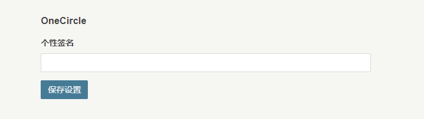

## onecircle 一个圈子，基于typecho

## 名字就叫一个圈子。
## version：3.0
## 平台：typecho

### 想弄一个类社交圈子，开发了一部分，剩下慢慢折腾

## 主题文档  
更多请查看[OneCircle 主题说明](https://www.yuque.com/docs/share/05f40cac-980f-4e53-8b92-ed9728b8dc50?#%E3%80%8AOneCircle%20%E4%B8%BB%E9%A2%98%E8%AF%B4%E6%98%8E%E3%80%8B)
  
(￢_￢)
目前特色有：
1. 前端仿推特
2. 支持前台直接提交，支持图文混合和链接、视频
3. 支持用户关注和取关，支持关注圈子并只显示关注的内容
4. 支持后台自定义设置
5. 支持用户注册默认更改权限为贡献者，并自动通过审核，这样新注册的用户也能自己发推了
6. 支持给每个新注册用户添加个人签名和tag
7. 支持免费的sm 图床
8. 支持博客页

## changeLog
v1.6 支持 pjax，以及前台登录发布文章，加入progress动画  
v1.7 bugs fix  
v1.8 gallery 支持，优化前台图片显示，后台添加编辑按钮  
v1.9 更新gallery 样式，添加置顶设置  
v2.0 添加用户关注圈子支持，新增动态页显示  
v2.1 新增圈友日记，新增标签管理独立页面  
v2.2 修复评论bug，新增转发和关注（每次关注有30%几率发一条post）  
v2.3 新增 头像和背景图设置  
v2.4 插件设置bug 修复  
v2.5 添加用户性别和个人情感状态    
v2.6 修复评论bug，修改link 显示  
v2.7 图床插件支持上传图片到本地，添加首页评论显示  
v2.8 添加 lazyload ，将默认的gallery 原始的background显示方式迁移至src显示
v3.0 支持博客页  
## 安装
下载 release 包：
内含：
onecircleTheme 主题
onecirclePlugin 配套插件
改版的注册登录美化插件
免费的图床插件

安装主题启用插件即可

## 注意：
因为 typecho 的bug，导致每次在个人设置里都会显示之前的缓存内容，而不是用户最新填写的数据，给用户带来困扰 - -  
所以解决办法有两种：
1. 每次修改的时候都把所有字段修改了，因为只修改某一个，其他字段还是用的某次的缓存
2. 修复bug：很简单，方法如下：  
找到源码的 var/Widget/Users/Profile.php 中的personalForm 函数，把中间这个if判断，由原来的
```
if (!empty($options)) {
            foreach ($options as $key => $val) {
                $form->getInput($key)->value($val);
            }
        }
```  
改成：
```
if (!empty($options)) {
            foreach ($options as $key => $val) {
                if (!$form->getInput($key)){
                    $form->getInput($key)->value($val);
                }
            }
        }
```
  
**说明：**  
1. 开启伪静态  
    我是按照默认 '默认风格 /archives/{cid}/'设置的，不保证其他的有效
2. 添加分类怎么设置分类图标？
    在分类描述中，格式如下:  <图片url>分类的描述什么的

## 关于 typecho 上传文件
typecho 1.0 版本的时候在判断是虚拟机的时候禁止上传附件。
解决方案都一样：http://www.phpnote.net/index.php/Home/Article/index/id/54  
首先我是找到var/Typecho/Common.php这个文件并更改415行左右的一个关于你服务器的函数。
```
public static function isAppEngine()
{
    return !empty($_SERVER['HTTP_APPNAME'])                     // SAE
        || !!getenv('HTTP_BAE_ENV_APPID')                       // BAE
        || !!getenv('SERVER_SOFTWARE')                          // BAE 3.0
        || (ini_get('acl.app_id') && class_exists('Alibaba'))   // ACE
        || (isset($_SERVER['SERVER_SOFTWARE']) && strpos($_SERVER['SERVER_SOFTWARE'],'Google App Engine') !== false) // GAE
        ;
}
```  
把这个函数直接改成:
```
public static function isAppEngine()
{
return false;
}
```
然后去 typecho 目录下的 usr 目录下创建uploads 文件夹，给权限 0777 就好了。  

----
## 添加链接

自定义页面取友情链接！

!!!

[links]

[名称](网址)+(头像)

[/links]

!!!

##如何添加导航图标
进入网址https://www.iconfont.cn/

寻找心爱的图标

方法:
找到图标后，点击复制svg  

然后再填到后台模板设置->自定义导航小图标
每个svg对应着每一个独立页面（粘贴一个svg 回车换行在粘贴下一个）

----
#### 截图：

index  


links  


图文混合  


支持用户关注  


主题设置  


签名设置  


### 感谢以下作者的辛苦付出
- compress https://javascript-minifier.com/
- css compress https://www.runoob.com/csspack
- 部分代码来自handsome、 [landstar](https://dyedd.cn)、油油的twitter、[joe博客](http://ae.js.cn/about.html) 等主题，感谢作者的辛苦付出