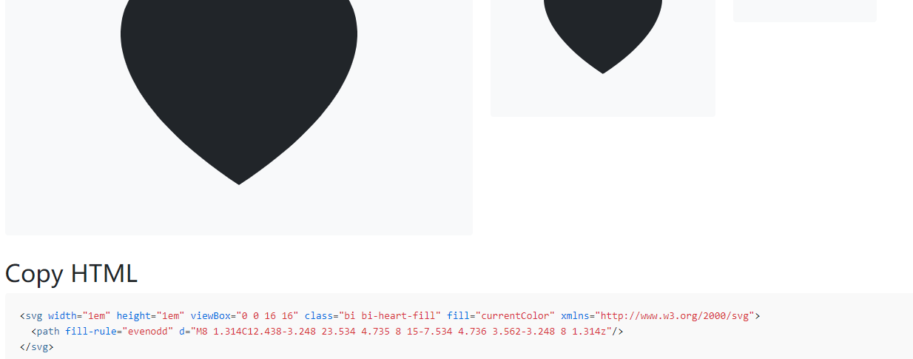

## onecircle 一个圈子，基于typecho

## 名字就叫一个圈子。
## version：2.0
## 平台：typecho

### 想弄一个类社交圈子，开发了一部分，剩下慢慢折腾

(￢_￢)
目前特色有：
1. 前端仿推特
2. 支持前台直接提交，支持图文混合和链接、视频
3. 支持用户关注和取关，支持关注圈子并只显示关注的内容
4. 支持后台自定义设置
5. 支持用户注册默认更改权限为贡献者，并自动通过审核，这样新注册的用户也能自己发推了
6. 支持给每个新注册用户添加个人签名和tag
7. 支持免费的sm 图床

## changeLog
v1.6 支持 pjax，以及前台登录发布文章，加入progress动画
v1.7 bugs fix
v1.8 gallery 支持，优化前台图片显示，后台添加编辑按钮
v1.9 更新gallery 样式，添加置顶设置
v2.0 添加用户关注圈子支持，新增动态页显示

## 安装
下载 release 包：
内含：
onecircleTheme 主题
onecirclePlugin 配套插件
改版的注册登录美化插件
免费的图床插件

安装主题启用插件即可

**说明：**  
1. 如果要开启伪静态  
    我是按照默认 '默认风格 /archives/{cid}/'设置的，不保证其他的有效
2. 添加分类怎么设置分类图标？
    在分类描述中，格式如下:  <图片url>分类的描述什么的

##如何添加导航图标
进入网址https://icons.getbootstrap.com/

寻找心爱的图标

方法

如上图所示，取heart-fill

然后再填到后台模板设置->自定义导航小图标
每行一个对应着每一个独立页面

----
#### 截图：

index

links

图文混合

支持用户关注

主题设置

签名设置

### 感谢以下作者的辛苦付出
- compress https://javascript-minifier.com/
- css compress https://www.runoob.com/csspack
- 修改自 [landstar](https://dyedd.cn) up to version :2.0.2